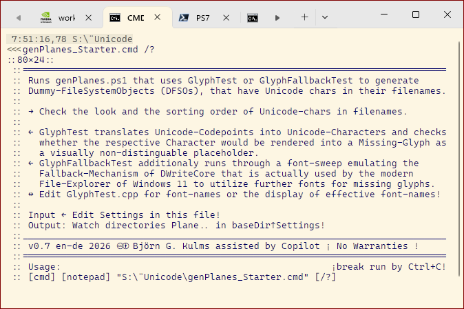
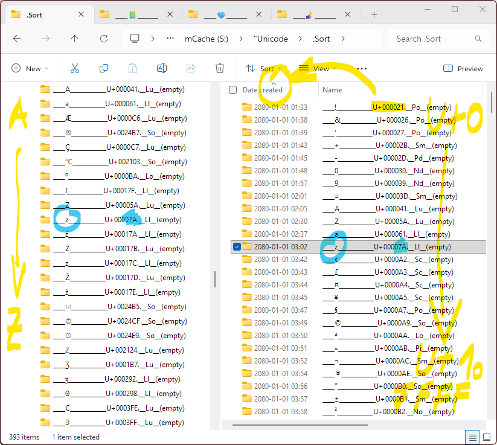
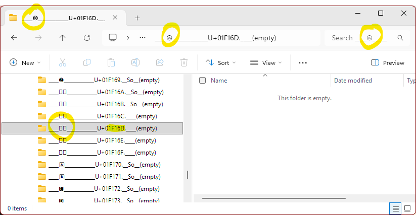
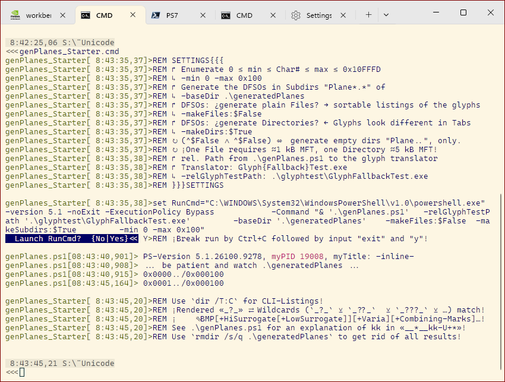

Interested in a comprehensive listing of all currently [Build 26200.9278] renderable Unicode-chars, only? [Download ./dist/Generated=SegoeUI+Fallback.Unicode-Dirs.7z](./dist/Generated=SegoeUI+Fallback.Unicode-Dirs.7z)

#### Known Problems / Missing Features:

The sort-by-name-heuristics of Windows File-Explorer prefers regular keyboard-characters against leading other characters (and do other sophisticated stuff like ordering 2 before 10). For instance, a `🡻` (U+01F87B) is ranked after `Z` (U+00005A), but `🡻A` will be sorted to a position before `Z`. If you need comparisons like «Which `<U+ppxxxx>A` would be ranked after `Z`?» you'd need to construct this manually. The filename given to the generated dummy FileSystem-Objects (DFSO) can be edited easily in `genPlanes.ps1` (`$FSOName`) — feel free to complement a function that decodes U+ppxxxx from the synthetic ctime!

Not a bug, but irregularities: `GlyphTest` tests for the existence of U+ppxxxx in the given font, `GlyphFallbackTest` tests its renderability (through a font-sweep simulating the fallback-mechanism), i.e. non-existent or non-renderable U+ppxxxx will be skipped without a DFSO being generated. However, File-Exlorer might show a Missing-Glyph or sequences of Missing-Glyphs. Try Copy&Paste, and compare tab-headers or dir-listings in the terminal! 

Which font is given, currently is hard-coded in `GlyphTest.cpp` (default: Segoe UI). Prerequisites, how to recompile `GlyphTest.cpp` are shown in the output of `buildAndTest-GlyphTest.cmd`. In `buildAndTest-GlyphTest.cmd` you'd find testcases commented out as "non-funct" – because I [neither me nor Copilot] didn't find a U+ppxxxx to trigger the respective fallback. Propositions are welcome! 

#### Disclaimer:

Rather fork than contribute! I'm publishing this stuff, that needs quite some empirical research, since I lack the capacity to maintain it.
